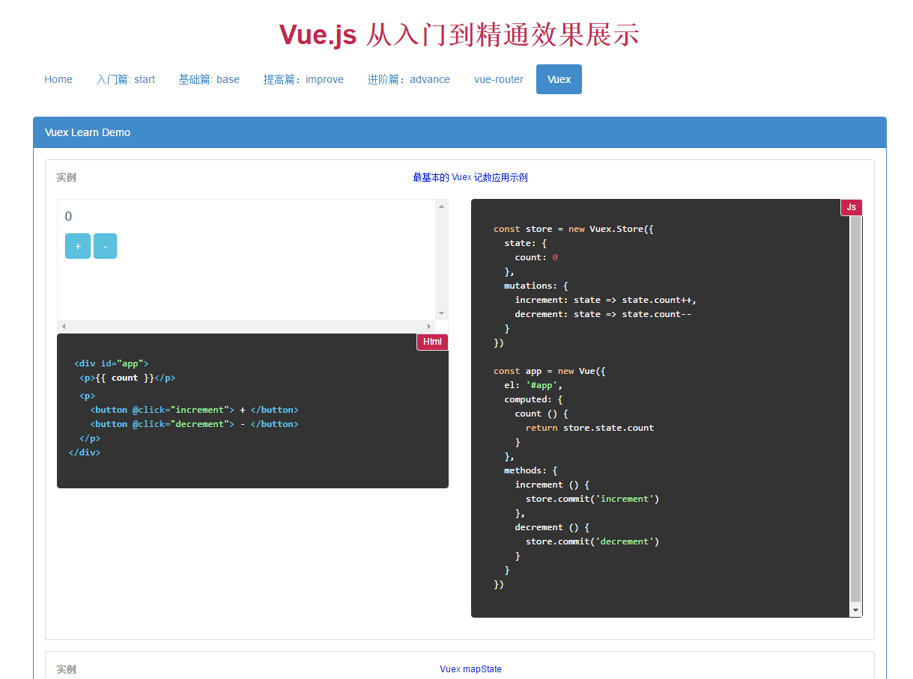

# Vue Learn

> A Vue.js2.0 project with Bootstrap which integrated the vue official online examples to components and some components build by myself to anyone who interested in .

<div align="center">
  
</div>

## Dev Environment

`npm install`

`npm run dev`

###The initial access path：
<ul>
<li>OfficialDemo： http://localhost:9091/officialdemo.html</li>
<li>TableHome： http://localhost:9091/tablehome.html</li>
</ul>

you can click the nav '案例：Examples' and choice 'TableHome' to jump to another project 'tablehome.html'.

## Prod Environment

`npm install`

`npm run build`

Please take the published content to the local server IIS or on another server you like ,

and then the initial access path ：(serverIP)/officialdemo.html

## Build Setup

``` bash
# 安装vue-cli
npm install -g vue-cli

# 使用vue-cli初始化项目
vue init webpack my-project

# 进入到目录
cd my-project

# install dependencies
npm install

# serve with hot reload at localhost:8080
npm run dev

# build for production with minification
npm run build

# run unit tests
npm run unit

# run e2e tests
npm run e2e

# run all tests
npm test
```

Welcome guidance ！！
